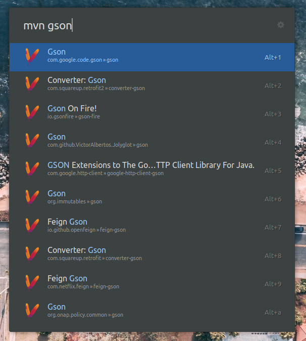

# ulauncher-maven

This extension allows the user to quickly search for maven dependencies on [mvnrepository.com](mvnrepository.com) and
open the result in their browser.

## Prerequisites

Please make sure you have `requests` and `beautifulsoup4` installed:

* `pip3 install requests`
* `pip3 install beautifulsoup4`
